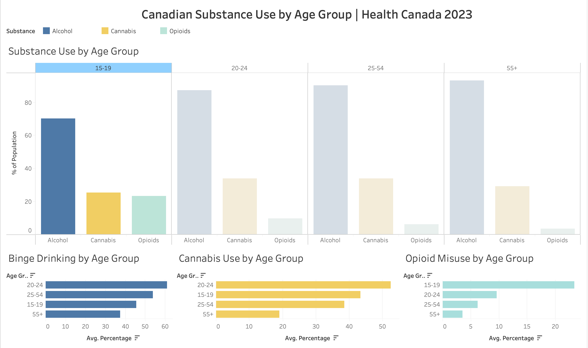

# Canadian Substance Use Dashboard

## Live Dashboard
[View the Interactive Dashboard on Tableau Public](https://public.tableau.com/app/profile/madina.alizada/viz/Book1_17787142620000/Dashboard1)

## What is this project?
This project explores how alcohol, cannabis, and opioid use varies across different age groups in Canada, using real survey data collected by Health Canada's Canadian Substance Use Survey (CSUS) 2023, which surveyed over 36,000 Canadians aged 15 and older.

## Why did I build this?
Substance use has become so normalized in our society that people are forgetting about the real effects it has on human beings. I wanted to look at the actual data and understand which age groups are most affected, and turn that into something visual that makes people stop and actually think.

## Key Findings
- 20-24 year olds have the highest binge drinking and cannabis use rates in Canada
- 15-19 year olds show the highest non-medical opioid misuse rate at around 23%
- 55+ Canadians have the highest lifetime alcohol use at around 93%

## Data Source
Canadian Substance Use Survey (CSUS) 2023 from Health Canada
health-infobase.canada.ca/substance-use/csus

## Tools Used
- Python (pandas) for data cleaning and preparation
- Jupyter Notebook for documented data pipeline
- Tableau Public for visualization and dashboard building
- GitHub for version control and project storage

## Project Structure
- data/ — raw CSV files from Health Canada and clean master dataset
- scripts/ — Jupyter Notebook with full documented data pipeline
- docs/ — project documentation, mockup, and writeup

## Full Documentation
[Read the full non-technical project documentation](docs/project-documentation.md)
